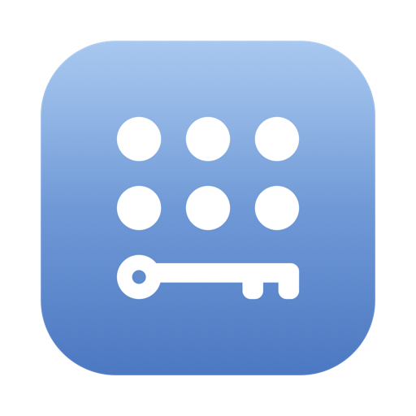
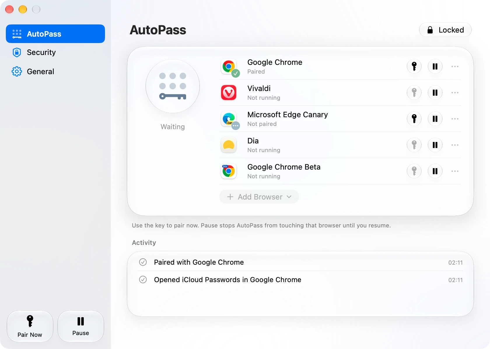

  

<h1 align="center">AutoPass</h1>

  無需再手動輸入 6 位數驗證碼。一款安全的 macOS 工具程式，可為第三方瀏覽器自動完成 iCloud Passwords 配對。

  <a href="../../README.md">English</a> · <a href="README.zh-Hans.md">简体中文</a> · <b>繁體中文</b> · <a href="README.es.md">Español</a> · <a href="README.fr.md">Français</a> · <a href="README.de.md">Deutsch</a> · <a href="README.ja.md">日本語</a> · <a href="README.ko.md">한국어</a> · <a href="README.pt-BR.md">Português (Brasil)</a> · <a href="README.ru.md">Русский</a> · <a href="README.it.md">Italiano</a>

  

## 功能

Apple 的 iCloud Passwords 擴充功能（適用於 Chrome、Edge、Vivaldi、Brave、Arc 等瀏覽器）會透過顯示一組 6 位數驗證碼來與你的 Mac 配對，你需要手動重新輸入。每次重新啟動瀏覽器後，以及每隔幾個小時都會發生一次。AutoPass 會替你輸入驗證碼，並透過多重檢查，讓它幾乎與手動輸入一樣安全。

- **自動開始。** 開始瀏覽並停頓約一秒後，AutoPass 會打開 iCloud Passwords、輸入驗證碼，並再次關閉彈出視窗。
- **同時支援多個瀏覽器**，每個瀏覽器都有各自的配對和暫停按鈕。可加入 Apple 輔助程式支援的任何瀏覽器。
- **快速而安靜。** Apple 的驗證碼視窗只會在螢幕上停留幾毫秒；如果你在此期間輸入或切換視窗，AutoPass 會稍後接著完成。
- **常駐選單列。** 配對完成後圖像會變為實心，一眼就能看出狀態。
- **支援 11 種語言**，可跟隨你的 Mac，也可自行選擇。

## 安裝

1. **下載** [Releases](https://github.com/ZhehanZhang/AutoPass/releases) 頁面中最新的 `AutoPass-x.y.z.zip`，解壓縮後將 AutoPass 移到「應用程式」。它已由 Apple 簽署並公證，支援 macOS 14 或以上版本，適用於 Apple 晶片和 Intel。
2. **在瀏覽器中加入 iCloud Passwords。** 如果尚未加入，AutoPass 會提示你安裝或為你開啟。將它釘選到工具列是選用的。
3. **打開 AutoPass，並在提示時允許「輔助使用」。** 沒有它，AutoPass 無法看到 Apple 的驗證碼視窗，也無法輸入；在「系統設定」中開啟後，它會自動繼續。

就這樣。啟動瀏覽器，照常瀏覽即可。

## 安全嗎？

只有以下每一項都成立時，AutoPass 才會輸入：

- 驗證碼來自 Apple 自己簽署的輔助程式，並且只會輸入到 Apple 的 iCloud Passwords 彈出視窗中。
- 該瀏覽器是你信任的，透過其程式碼簽章識別，並且它是最前方的 App。
- 你已經停止輸入。
- （選用）你已用 Touch ID 或密碼核准。你可以要求在輸入前，以及更改設定前進行核准。

從不使用剪貼簿，驗證碼從不被儲存或記錄，AutoPass 也沒有任何連網程式碼。詳情請見 [docs/SAFETY.md](../SAFETY.md)（英文）。

## 語言

AutoPass 會跟隨你 Mac 的語言，你也可以在 **設定 → 一般 → 語言** 中選擇：English, 简体中文, 繁體中文, Español, Français, Deutsch, 日本語, 한국어, Português (Brasil), Русский, Italiano。本頁面也提供上述各語言版本，請使用頂部的連結切換。

## 開發者

從原始碼建置、安全模型的詳細說明，以及如何新增或修正翻譯，請見 [docs/DEVELOPING.md](../DEVELOPING.md) 和 [docs/SAFETY.md](../SAFETY.md)（英文）。

## 授權條款

AutoPass 是依據 [GNU Affero 通用公共授權條款第 3 版](../../LICENSE)發布的自由軟體。原始碼：<https://github.com/ZhehanZhang/AutoPass>。作者的更多內容：<https://zhehanz.com>。
